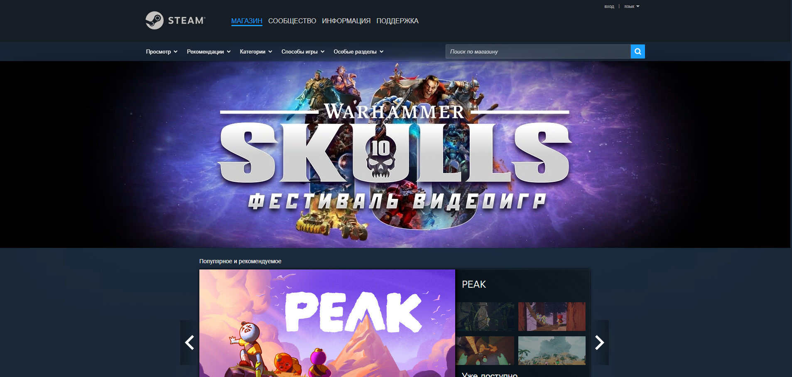

# Проект по тестированию игрового магазина <a target="_blank" href="https://store.steampowered.com/">Steam</a>

---
### Проверки
1. Поиск игры по наименованию.
2. Смена языка
3. Переход по вкладкам
4. Работа с корзиной
---

### Инструменты
           

---
